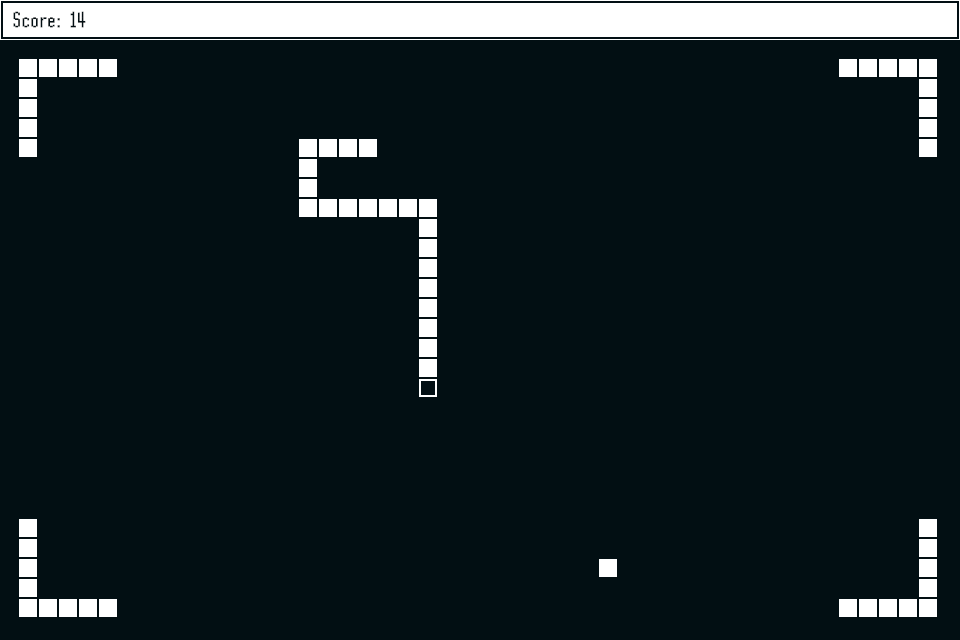

# Snake

](https://travis-ci.org/MoritzKn/ggez-snake)

Snake Game made with [ggez](http://ggez.rs/).



## Build instructions
1. Download the source code from [here](https://github.com/MoritzKn/ggez-snake/releases) or clone the git repo.
   ```sh
   git clone https://github.com/MoritzKn/ggez-snake.git
   cd ggez-snake
   ```
2. Download the dependencies and compile the source code using
   [Cargo](https://crates.io/install).
   ```sh
   cargo build --release
   ```

After cargo is done the binaries are placed under `./target/release/ggez-snake`.
